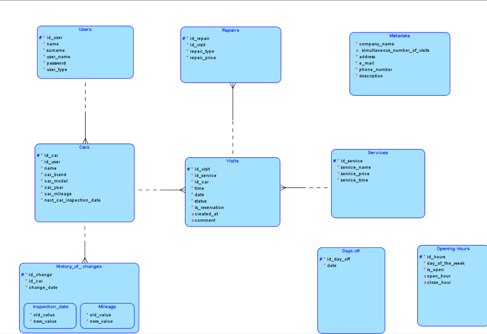

# BD2 - zespół 1

Skład zespołu:
- Brygida Silawko
- Tomasz Smoleń
- Kornelia Błaszczuk
- Kinga Łukiewicz
- Aleksandra Raczyńska

## Model ER i relacyjny

Dostępne są w plikach baza.dmd oraz katalogu baza.

Poniżej model ER:



## Funkcjonalności

Wszystkie funkcjonalności są widoczne w projekcie apikacji.

Link do projektu: https://www.figma.com/proto/D5HsHUm82rfYiGNXeeGz8o/BD2---Serwis?node-id=0-1&t=Cvj9zYLqq3lRClIF-1

Główne funkcjonalności:
- udostepnienie cennika warsztatu oraz jego danych adresowych,
- konta użytkowników,
- możliwość dodawania swoich aut i umawiania dla nich wizyt,
- wgląd w historię wizyt,
- dostęp do raportu z wizyty w formacie pdf,
- dla administratora warsztatu: wypełnianie raportów z napraw oraz ustawianie prametrów warsztatu.

Naszym założeniem projektowym jest baza danych dedykowana dla konkretnego warsztatu.

## Elementów funkcjonalnych na poziomie bazy danych

Został opracowany trigger dotyczący tabeli metadane - zapewnia on maksymalnie jeden wiersz danych.

Kod triggera znajduje się w pliku triiger_metadata.sql

## Część analityczno-statystyczna
Opracowano wykresy dla admina (ułatwiające analizę funkcjonowania warsztatu) oraz dla samochodu (pozwalające kontrolować historię zmiany przebiegu samochodu). 

### Wykresy dla administratora
- Wykres napraw i usług w wybranym okresie czasu,
- Wykres zarobków warsztatu w wybranym okresie.

### Wykres dla samochodu
- Wykres historii zmiany przebiegu samochodu.

## Dobór technologii

1. Baza danych
 - PostgreSQL 17 w wersji chmurowej,
 - nie wymaga żadnych dodatkowych instalacji ani konfiguracji.

2. Aplikacja
 - SpringBoot + Node.js,
 - instalacja: JDK, Gradle, Node.js,
 - konfiguracja środowiska: plik .env z parametrami do połączenia z bazą.

 ## Scenariusze i dane testowe

Wiekszość danych testowych została wprowadzona podczas testowania poszczególnych komponentów aplikacji.

## Uruchomienie projektu
Zalecane uruchomienie w aplikacji IntelliJ IDEA.

1. W folderze `frontend` należy zainstalować bibliotekę `yarn`, a następnie wpisać w terminalu polecenie:
```bash
yarn dev
```
2. W folderze `wsapi` należy umieścić plik `.env` oraz skonfigurować w aplikacji Spring Boot - WsapiApplication.
W sekcji `build and run` należy wpisać następujące opcje:
- java 22
- wsapi.main 
- com.workshop.wspai.WsapiApplication
Należy również dodać opcję `enviroment variables` i w nim podać ścieżkę do pliku `.env`.
